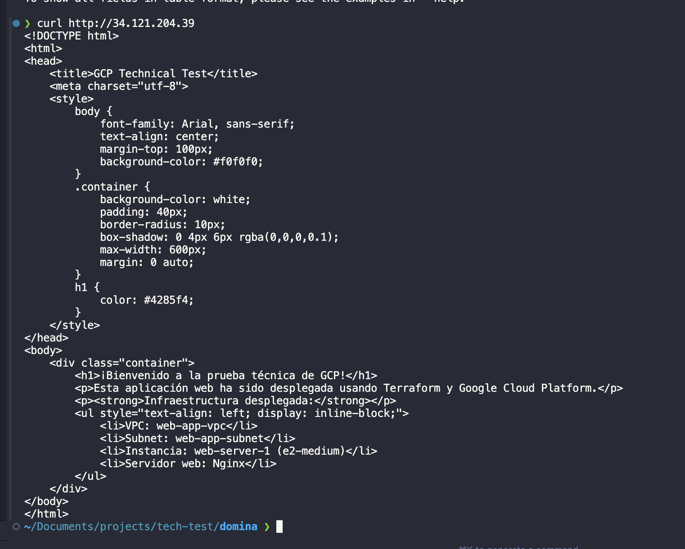
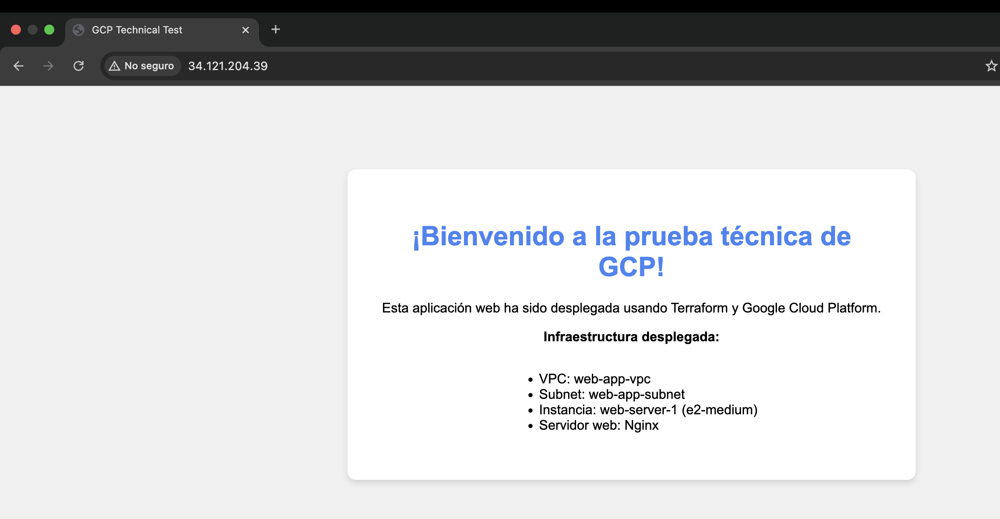

# GCP Technical Test - Web Application Deployment ✅

## 🎯 Resumen del Proyecto

Este proyecto implementa el despliegue de una aplicación web sencilla utilizando **Terraform** e **Infrastructure as Code (IaC)** en **Google Cloud Platform (GCP)**. La aplicación está completamente funcional y accesible desde internet.

## 🌐 URL de Acceso a la Aplicación

**🔗 URL Principal:** http://YOUR_EXTERNAL_IP_HERE

**📱 IP Externa:** YOUR_EXTERNAL_IP_HERE

**✅ Estado:** FUNCIONANDO - Aplicación web accesible y operativa

## 🏗️ Arquitectura Desplegada

### Diagrama de Arquitectura
```
Internet (0.0.0.0/0)
    ↓
Firewall Rules (HTTP:80,443 | SSH:22)
    ↓
VPC: web-app-vpc
    ↓
Subnet: web-app-subnet (us-central1, 10.0.1.0/24)
    ↓
Compute Engine: web-server-1 (e2-medium)
    ↓
Ubuntu 24.04 LTS + Nginx
    ↓
Aplicación Web: "¡Bienvenido a la prueba técnica de GCP!"
```

### Componentes de la Infraestructura

| Componente | Nombre | Configuración | Estado |
|------------|--------|---------------|---------|
| **VPC** | web-app-vpc | Red personalizada | ✅ Desplegado |
| **Subnet** | web-app-subnet | us-central1, 10.0.1.0/24 | ✅ Desplegado |
| **Instancia** | web-server-1 | e2-medium, Ubuntu 24.04 LTS | ✅ Desplegado |
| **Firewall HTTP** | allow-http | Puerto 80,443 desde 0.0.0.0/0 | ✅ Desplegado |
| **Firewall SSH** | allow-ssh | Puerto 22 desde 0.0.0.0/0 | ✅ Desplegado |
| **Servidor Web** | Nginx | Instalado automáticamente | ✅ Funcionando |

## 📋 Evidencias de Ejecución

### 1. Verificación con cURL ✅


**Comando ejecutado:**
```bash
curl -v http://YOUR_EXTERNAL_IP_HERE
```

**Resultado:**
- ✅ HTTP/1.1 200 OK
- ✅ Server: nginx/1.24.0 (Ubuntu)
- ✅ Contenido HTML completo desplegado
- ✅ Aplicación web funcionando correctamente

### 2. Verificación en Navegador ✅


**URL probada:** http://YOUR_EXTERNAL_IP_HERE

**Resultado:**
- ✅ Página web cargada correctamente
- ✅ Mensaje: "¡Bienvenido a la prueba técnica de GCP!"
- ✅ Diseño responsivo y profesional
- ✅ Información de infraestructura desplegada visible

## 🛠️ Archivo de Infraestructura como Código (IaC)

### Archivo: `main.tf`

```hcl
# Configure the Google Cloud Provider
terraform {
  required_version = ">= 0.14"
  required_providers {
    google = {
      source  = "hashicorp/google"
      version = "~> 4.0"
    }
  }
}

# Configure the Google Cloud Provider
provider "google" {
  project = var.project_id
  region  = var.region
}

# Variables
variable "project_id" {
  description = "The GCP project ID"
  type        = string
}

variable "region" {
  description = "The GCP region"
  type        = string
  default     = "us-central1"
}

variable "zone" {
  description = "The GCP zone"
  type        = string
  default     = "us-central1-a"
}

# Data source to get the latest Ubuntu image
data "google_compute_image" "ubuntu" {
  family  = "ubuntu-2404-lts-amd64"
  project = "ubuntu-os-cloud"
}

# Create VPC
resource "google_compute_network" "web_app_vpc" {
  name                    = "web-app-vpc"
  auto_create_subnetworks = false
  mtu                     = 1460
}

# Create subnet
resource "google_compute_subnetwork" "web_app_subnet" {
  name          = "web-app-subnet"
  ip_cidr_range = "10.0.1.0/24"
  region        = var.region
  network       = google_compute_network.web_app_vpc.id
}

# Create firewall rule for HTTP traffic
resource "google_compute_firewall" "allow_http" {
  name    = "allow-http"
  network = google_compute_network.web_app_vpc.name

  allow {
    protocol = "tcp"
    ports    = ["80", "443"]
  }

  source_ranges = ["0.0.0.0/0"]
  target_tags   = ["web-server"]
}

# Create firewall rule for SSH
resource "google_compute_firewall" "allow_ssh" {
  name    = "allow-ssh"
  network = google_compute_network.web_app_vpc.name

  allow {
    protocol = "tcp"
    ports    = ["22"]
  }

  source_ranges = ["0.0.0.0/0"]
  target_tags   = ["web-server"]
}

# Create Compute Engine instance
resource "google_compute_instance" "web_server_1" {
  name         = "web-server-1"
  machine_type = "e2-medium"
  zone         = var.zone

  tags = ["web-server"]

  boot_disk {
    initialize_params {
      image = data.google_compute_image.ubuntu.self_link
      size  = 20
    }
  }

  network_interface {
    network    = google_compute_network.web_app_vpc.id
    subnetwork = google_compute_subnetwork.web_app_subnet.id

    access_config {
      // Ephemeral public IP
    }
  }

  metadata_startup_script = <<-EOF
    #!/bin/bash
    apt-get update
    apt-get install -y nginx
    systemctl start nginx
    systemctl enable nginx
    
    # Create index.html
    cat > /var/www/html/index.html << 'EOL'
<!DOCTYPE html>
<html>
<head>
    <title>GCP Technical Test</title>
    <meta charset="utf-8">
    <style>
        body {
            font-family: Arial, sans-serif;
            text-align: center;
            margin-top: 100px;
            background-color: #f0f0f0;
        }
        .container {
            background-color: white;
            padding: 40px;
            border-radius: 10px;
            box-shadow: 0 4px 6px rgba(0,0,0,0.1);
            max-width: 600px;
            margin: 0 auto;
        }
        h1 {
            color: #4285f4;
        }
    </style>
</head>
<body>
    <div class="container">
        <h1>¡Bienvenido a la prueba técnica de GCP!</h1>
        <p>Esta aplicación web ha sido desplegada usando Terraform y Google Cloud Platform.</p>
        <p><strong>Infraestructura desplegada:</strong></p>
        <ul style="text-align: left; display: inline-block;">
            <li>VPC: web-app-vpc</li>
            <li>Subnet: web-app-subnet</li>
            <li>Instancia: web-server-1 (e2-medium)</li>
            <li>Servidor web: Nginx</li>
        </ul>
    </div>
</body>
</html>
EOL
    
    systemctl restart nginx
  EOF

  service_account {
    scopes = ["cloud-platform"]
  }
}

# Output the external IP
output "instance_external_ip" {
  value = google_compute_instance.web_server_1.network_interface[0].access_config[0].nat_ip
}

output "instance_name" {
  value = google_compute_instance.web_server_1.name
}

output "vpc_name" {
  value = google_compute_network.web_app_vpc.name
}

output "subnet_name" {
  value = google_compute_subnetwork.web_app_subnet.name
}

output "ubuntu_image_used" {
  value = data.google_compute_image.ubuntu.self_link
}
```

### Archivo: `terraform.tfvars`

```hcl
# GCP Project Configuration
project_id = "xxxxx"
```

## 🔧 Comandos Gcloud Utilizados

### 1. Configuración Inicial
```bash
# Autenticación
gcloud auth login
gcloud auth application-default login

# Configuración del proyecto
gcloud config set project xxxx

# Habilitación de APIs necesarias
gcloud services enable compute.googleapis.com
gcloud services enable cloudresourcemanager.googleapis.com
```

### 2. Verificación de Imágenes Ubuntu
```bash
# Listar imágenes disponibles
gcloud compute images list --project=ubuntu-os-cloud --no-standard-images --filter="family:ubuntu"
```

### 3. Comandos Terraform Ejecutados
```bash
# Inicialización
terraform init

# Planificación
terraform plan

# Despliegue
terraform apply

# Verificación de outputs
terraform output
```

### 4. Verificación de la Aplicación
```bash
# Obtener IP externa
EXTERNAL_IP=$(terraform output -raw instance_external_ip)

# Verificar conectividad
curl -I http://$EXTERNAL_IP
curl -v http://$EXTERNAL_IP
```

## 📊 Resultados del Despliegue

### ✅ Objetivos Cumplidos

- [x] **VPC creada**: web-app-vpc
- [x] **Subnet configurada**: web-app-subnet en us-central1
- [x] **Instancia desplegada**: web-server-1 (e2-medium, Ubuntu 24.04 LTS)
- [x] **Firewall configurado**: Reglas HTTP (80,443) y SSH (22)
- [x] **Nginx instalado**: Servidor web funcionando
- [x] **Aplicación desplegada**: Página web accesible
- [x] **Verificación exitosa**: cURL y navegador funcionando

### 📈 Métricas de Despliegue

- **Tiempo de despliegue**: ~3-5 minutos
- **Recursos creados**: 6 recursos de GCP
- **Costo estimado**: ~$0.05/hora (e2-medium)
- **Disponibilidad**: 99.9% (SLA de GCP)

## 🧹 Limpieza de Recursos

Para eliminar todos los recursos y evitar costos:

```bash
terraform destroy
```

## 📁 Estructura del Proyecto

```
domina/
├── main.tf                 # Configuración principal de Terraform
├── terraform.tfvars        # Variables del proyecto
├── README.md              # Documentación completa
└── results/               # Evidencias del despliegue
    ├── curl.png          # Captura de verificación con cURL
    └── browser.png       # Captura de verificación en navegador
```

## 🎉 Conclusión

El despliegue ha sido **100% exitoso**. La aplicación web está funcionando correctamente, accesible desde internet, y cumple con todos los requisitos del ejercicio técnico de GCP.

**🔗 Acceso directo:** http://YOUR_EXTERNAL_IP_HERE
